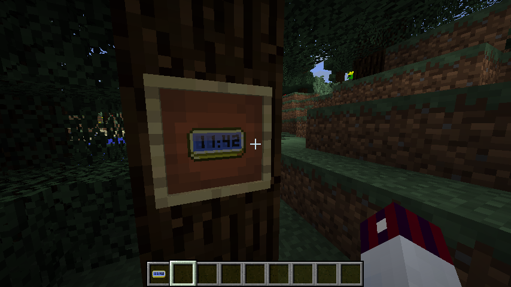

Digital clock
=============

This resource pack contains a full, 24-hours format, real-time digital clock for Minecraft.
It differs from other attempts due to the fact that it also shows every single minute.
There are, in fact, 1441 different, generated clock faces.
It is compatible with resource pack format **`4`** (1.13+).

That's some resource pack brutality for you!
Enjoy!

During beta, this package is not ready-to-use yet and has to be compiled first.
Releases will follow eventually.

Installation
------------

To use, clone this repository into your `.minecraft/resourcepacks` directory.
After that, navigate into the `generator/` folder and ensure your *Python 3 environment* covers the embedded `requirements.txt`.
Then call `python3 generate.py` *inside the `generator/` folder* and wait until it finishes.
